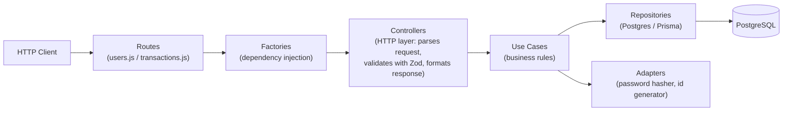
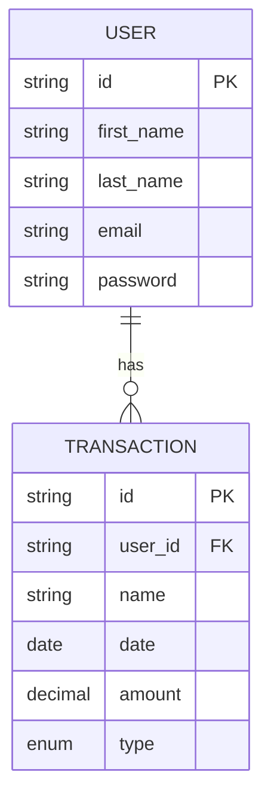

# DashFinTrack API

<p align="center">
  
  
  
  
  
  
</p>

<p align="center">
  A REST API for personal finance tracking. It manages users and their financial transactions (earnings, expenses, and investments) and exposes an endpoint that calculates a user's balance in real time.
</p>

---

## Table of Contents

- [About the project](#about-the-project)
- [Features](#features)
- [Technologies](#technologies)
- [Architecture](#architecture)
- [Folder structure](#folder-structure)
- [Data model](#data-model)
- [API endpoints](#api-endpoints)
- [How to run the project](#how-to-run-the-project)
- [Available scripts](#available-scripts)
- [Testing](#testing)
- [API documentation](#api-documentation)
- [Author](#author)

---

## About the project

**DashFinTrack API** is the backend service for a personal finance dashboard. It follows a **layered, dependency-injected architecture** (routes -> controllers -> use cases -> repositories -> database), inspired by Clean Architecture and SOLID principles. Each layer has a single responsibility and depends only on abstractions, which are wired together through **factories** (factory pattern).

Data validation is handled with **Zod** schemas, persistence is managed by **Prisma** over **PostgreSQL**, and the whole codebase is covered by **unit and end-to-end tests** written with **Jest** and **Supertest**.

## Features

| Feature | Description |
| --- | --- |
| User management | Create, retrieve, update, and delete users |
| Password hashing | Passwords are hashed with `bcrypt` before being persisted |
| Duplicate email protection | Prevents creating a user with an email that is already in use |
| Transaction management | Create, retrieve, update, and delete financial transactions |
| Transaction types | Each transaction is classified as `EARNING`, `EXPENSE`, or `INVESTMENT` |
| Balance calculation | Aggregates a user's earnings, expenses, and investments into a single balance |
| Input validation | Request bodies are validated against Zod schemas before reaching the business logic |
| Centralized error handling | Domain-specific errors (e.g. user not found, email already exists) are mapped to proper HTTP status codes |
| Interactive API docs | Swagger UI available at the `/docs` route |
| Automated testing | Unit tests for every use case/controller/adapter, plus end-to-end tests for the HTTP routes |

## Technologies

- **[Node.js](https://nodejs.org/)** (ES Modules) — JavaScript runtime
- **[Express 5](https://expressjs.com/)** — HTTP server and routing
- **[Prisma](https://www.prisma.io/)** — ORM for PostgreSQL, schema and migrations
- **[PostgreSQL](https://www.postgresql.org/)** — relational database
- **[Zod](https://zod.dev/)** — schema-based request validation
- **[bcrypt](https://www.npmjs.com/package/bcrypt)** — password hashing
- **[uuid](https://www.npmjs.com/package/uuid)** — unique ID generation
- **[dayjs](https://day.js.org/)** — date handling
- **[swagger-ui-express](https://www.npmjs.com/package/swagger-ui-express)** — interactive API documentation
- **[Jest](https://jestjs.io/)** + **[Supertest](https://www.npmjs.com/package/supertest)** — unit and end-to-end testing
- **[Faker](https://fakerjs.dev/)** — test data generation
- **Docker Compose** — local PostgreSQL instances for development and testing
- **ESLint + Husky** — code quality and pre-commit checks

## Architecture



Each HTTP route delegates to a controller created by a **factory function** (e.g. `makeCreateUserController`), which injects the concrete use case and its repository/adapter dependencies. This makes every layer easy to test in isolation, since dependencies can be replaced with mocks or stubs.

## Folder structure

```
DashFinTrack-api/
├── adapters/                      # Cross-cutting utilities (password hashing, ID generation)
│   ├── password-hasher.js
│   └── id-generator.js
├── docs/
│   └── swagger.json               # OpenAPI/Swagger specification
├── prisma/
│   ├── schema.prisma              # Database schema (User, Transaction)
│   ├── prisma.js                  # Prisma client instance
│   └── migrations/                # Database migration history
├── schemas/                       # Zod validation schemas
│   ├── user.js
│   └── transaction.js
├── src/
│   ├── app.js                     # Express app setup and route mounting
│   ├── routes/
│   │   ├── users.js
│   │   └── transactions.js
│   ├── controllers/
│   │   ├── user/                  # HTTP layer for user endpoints
│   │   └── transaction/           # HTTP layer for transaction endpoints
│   ├── use-cases/
│   │   ├── user/                  # Business rules for users (create, update, delete, balance...)
│   │   └── transaction/           # Business rules for transactions
│   ├── repositories/
│   │   └── postgres/              # Prisma-based data access (user, transaction)
│   ├── factories/
│   │   └── controllers/           # Wires controllers with their use cases and repositories
│   └── errors/                    # Custom domain errors (UserNotFoundError, EmailAlreadyExistsError, etc.)
├── tests/                         # Shared test fixtures
├── index.js                       # Application entry point
├── docker-compose.yml             # Local PostgreSQL (dev + test) containers
└── package.json
```

## Data model



`Transaction.type` accepts one of three values: `EARNING`, `EXPENSE`, or `INVESTMENT`. Deleting a user cascades and removes all of their transactions.

## API endpoints

### Users — `/api/users`

| Method | Route | Description |
| --- | --- | --- |
| `POST` | `/api/users` | Create a new user |
| `GET` | `/api/users/:userId` | Get a user by ID |
| `GET` | `/api/users/:userId/balance` | Get a user's aggregated balance (earnings, expenses, investments, total) |
| `PATCH` | `/api/users/:userId` | Update a user |
| `DELETE` | `/api/users/:userId` | Delete a user |

### Transactions — `/api/transactions`

| Method | Route | Description |
| --- | --- | --- |
| `POST` | `/api/transactions` | Create a new transaction |
| `GET` | `/api/transactions?userId=<id>` | List transactions for a given user |
| `PATCH` | `/api/transactions/:transactionId` | Update a transaction |
| `DELETE` | `/api/transactions/:transactionId` | Delete a transaction |

## How to run the project

> **Prerequisites:** [Node.js](https://nodejs.org/) and [Docker](https://www.docker.com/) installed.

```bash
# 1. Clone the repository
git clone https://github.com/joaovpzdev/DashFinTrack-api.git

# 2. Go into the project folder
cd DashFinTrack-api

# 3. Copy the environment variables file and fill in the values
cp .env.example .env

# 4. Start the PostgreSQL containers (development and test databases)
docker compose up -d

# 5. Install dependencies (this also runs "prisma generate" automatically)
npm install

# 6. Apply database migrations
npx prisma migrate dev

# 7. Start the development server
npm run start:dev
```

The API will be available at `http://localhost:<PORT>` (as defined in your `.env` file), and the interactive documentation at `http://localhost:<PORT>/docs`.

## Available scripts

| Script | Command | What it does |
| --- | --- | --- |
| `start:dev` | `npm run start:dev` | Starts the server in watch mode |
| `test` | `npm test` | Runs the test suite against the `.env.test` database |
| `test:watch` | `npm run test:watch` | Runs tests in watch mode |
| `test:coverage` | `npm run test:coverage` | Runs tests and generates a coverage report |
| `postinstall` | *(runs automatically)* | Generates the Prisma client after `npm install` |

## Testing

The project follows a test-driven approach, with each layer tested independently:

- **Unit tests** for adapters, use cases, and controllers, using mocked dependencies and Faker-generated data.
- **End-to-end tests** (`*.e2e.test.js`) for the HTTP routes, using Supertest against a real test database.

Run the full suite with:

```bash
npm run test
```

## API documentation

The full OpenAPI specification is available in [`docs/swagger.json`](./docs/swagger.json) and is served interactively at the `/docs` route once the server is running.

## Author

Developed by **João Victor Paixão Zolim** ([@joaovpzdev](https://github.com/joaovpzdev)).
